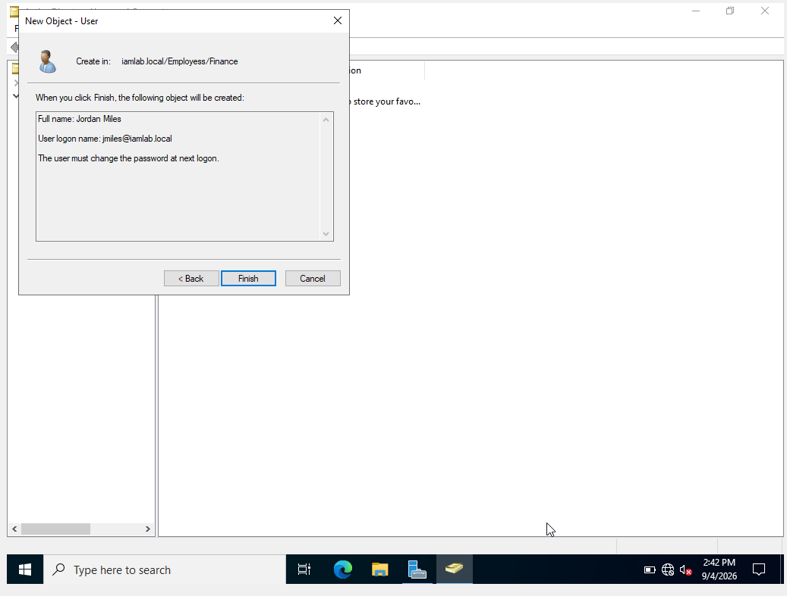
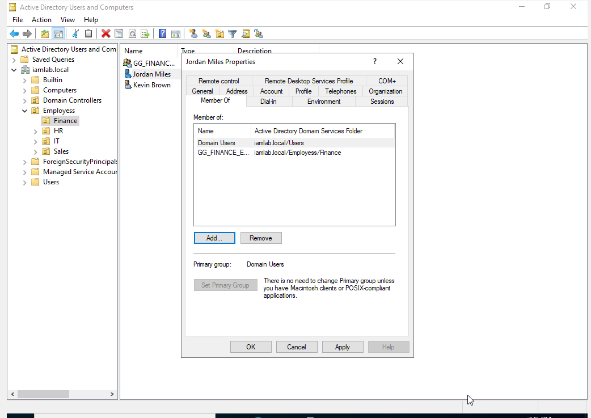
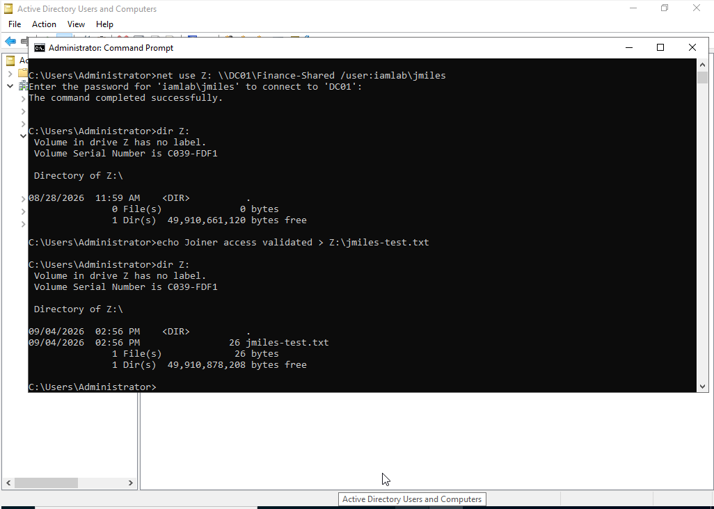
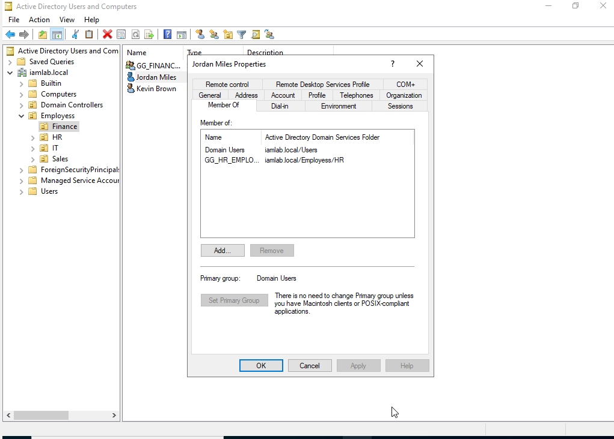
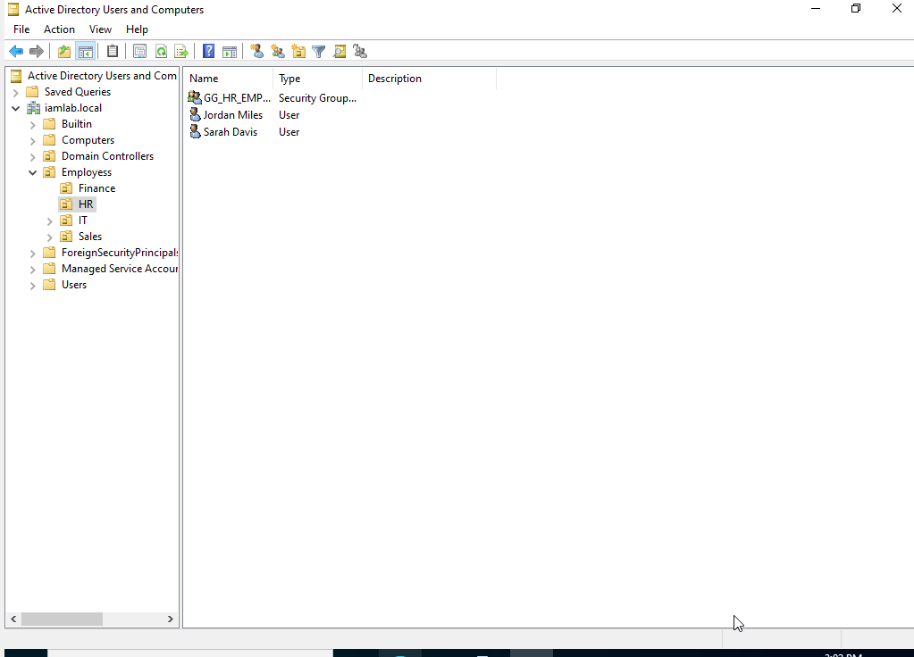
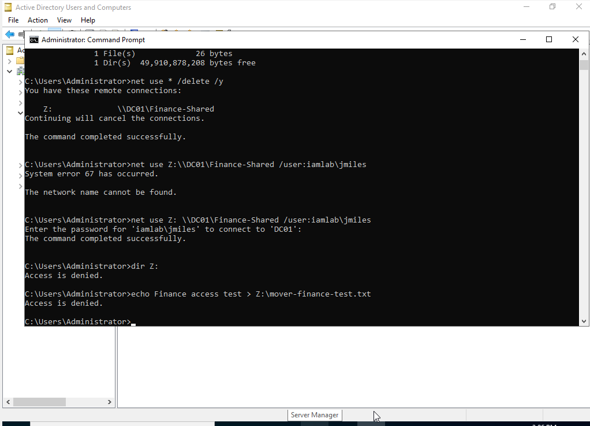
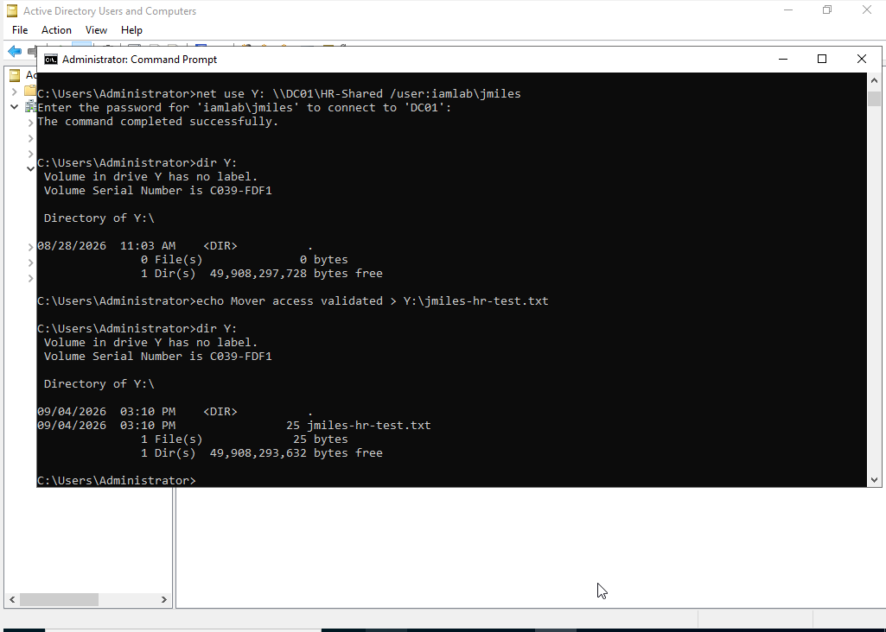
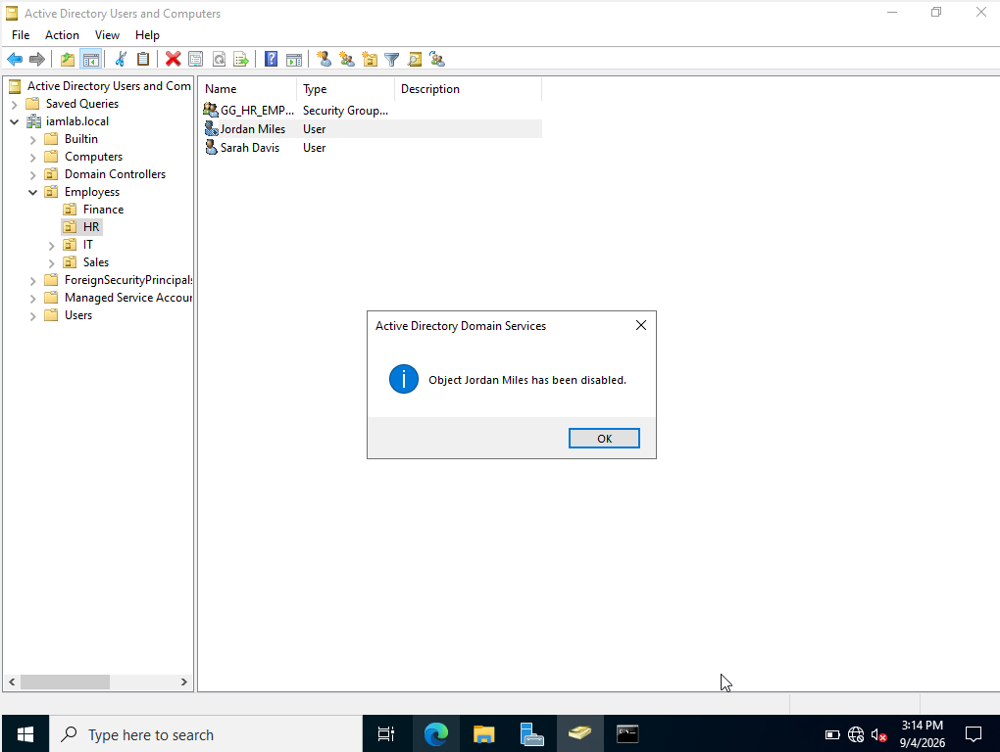
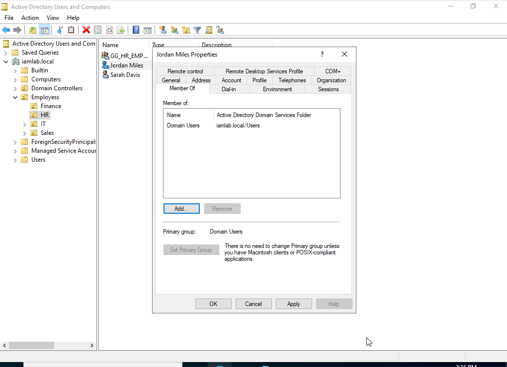
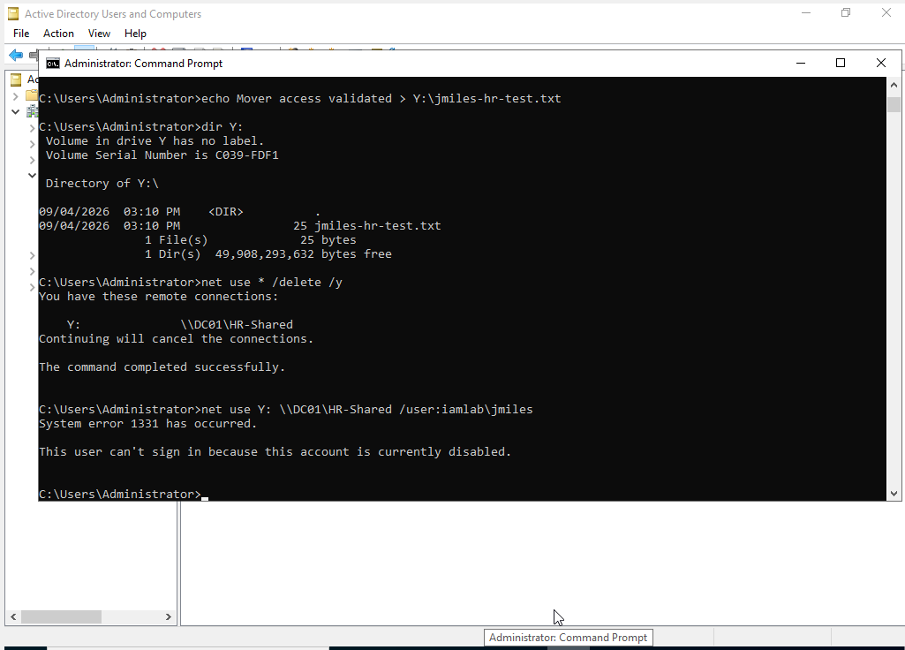

# IAM Joiner-Mover-Leaver (JML) Lifecycle Management Lab

## Project Overview
This project demonstrates the Joiner-Mover-Leaver (JML) identity lifecycle process using Microsoft Active Directory in a Windows Server lab environment.

The objective was to manage a user account through three stages of the identity lifecycle: onboarding a new employee, changing access when the employee moved departments, and removing access when the employee left the organization.

## Environment
- Windows Server 2022
- Active Directory Domain Services
- Active Directory Users and Computers
- Organizational Units (OUs)
- Active Directory Security Groups
- SMB File Shares
- NTFS Permissions
- Windows Command Prompt
- Oracle VirtualBox

## Scenario
A test employee named **Jordan Miles** (`jmiles`) was created and assigned to the Finance department. Jordan was later transferred from Finance to HR and was ultimately offboarded from the organization.

## Joiner Phase
A new Active Directory user account was created for Jordan Miles inside the Finance OU.

The account was added to the Finance security group to provide role-based access to departmental resources.

Access was validated by authenticating as Jordan, mapping the Finance SMB share, and successfully creating a test file.

**Result:** Jordan received the correct Finance access after onboarding.

### Joiner Evidence

**1.New user account created in the Finance OU**

**2.Finance security group assigned to provide role-based access**

**3.Finance access validated by mapping the share and creating a test file**

## Mover Phase
Jordan was transferred from Finance to HR.

The Finance security-group membership was removed and Jordan was added to the HR security group. The user account was also moved from the Finance OU to the HR OU.

Authorization testing confirmed that Jordan could no longer access the Finance share.

Jordan was then able to authenticate to the HR share and successfully create a test file.

**Result:** Previous departmental access was revoked and new role-based access was successfully granted.

### Mover Evidence

**4. Finance group access removed and HR security group assigned**

**5. User account moved from the Finance OU to the HR OU**

**6. Previous Finance access successfully revoked**

**7. New HR access validated by creating a test file**

## Leaver Phase
Jordan's Active Directory account was disabled as part of the offboarding process.

The HR security-group membership was removed, leaving only the default Domain Users membership.

A final authentication attempt was performed against the HR file share.

Windows returned:

`System error 1331`

`This user can't sign in because this account is currently disabled.`

**Result:** The disabled account could no longer authenticate to organizational resources.

### Leaver Evidence

**8. User account disabled during the offboarding process**

**9. HR security group membership removed**

**10. Disabled account prevented from authenticating to the HR share**

## IAM Concepts Demonstrated
- Joiner-Mover-Leaver lifecycle management
- User provisioning and deprovisioning
- Active Directory user administration
- Organizational Unit management
- Security-group administration
- Role-Based Access Control (RBAC)
- Least-privilege access
- Access revocation
- SMB share authorization
- NTFS permissions
- Authentication and authorization testing
- Identity lifecycle validation

## Key Takeaway
This lab demonstrates how identity and access should follow an employee throughout their lifecycle. Access was provisioned based on job responsibilities, modified when the employee changed roles, and revoked during offboarding.
